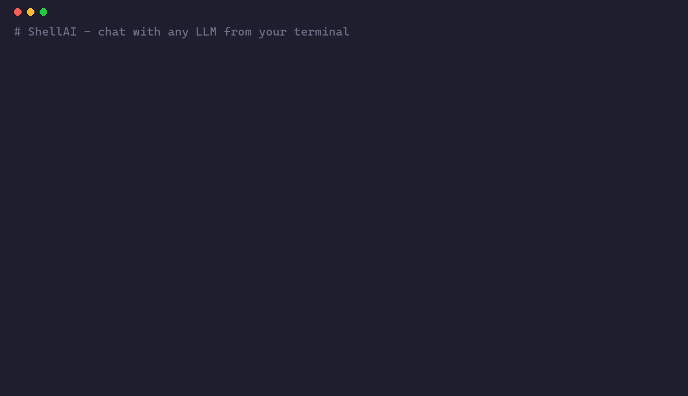

<div align="center">

# 🐚 ShellAI

### Chat with any LLM, right from your terminal. Local or cloud. Zero config.

[](https://pypi.org/project/shellai/)
[](https://www.python.org/)
[](https://github.com/djaferiurim/shellai/actions/workflows/ci.yml)
[](LICENSE)
[](#contributing)

**One command. Streaming answers. Markdown rendering. Pipe-friendly. Works offline with [Ollama](https://ollama.com) or online with OpenAI.**



</div>

---

```bash
$ ai "explain monads like I'm five"
```

> A monad is like a **box** 📦 you put a value in. The box knows how to
> open itself, do something with the value, and put the result back —
> so you never have to unwrap it by hand…

*(answer streams in live, rendered as Markdown)*

---

## ✨ Why ShellAI?

- 🚀 **Instant** — ask a question without leaving your shell
- 🤖 **Coding agent** — it can read, write, and run code to finish a task for you
- 🎬 **Media agent** — generate images & video, or a multi-scene storyboard
- 🧠 **Chat with your files** — index a folder and ask questions (local RAG)
- 🪄 **`ai do`** — turn plain English into a shell command, then run it
- 🎭 **Personas** — swap the assistant's style with named presets
- 🔌 **Provider-agnostic** — OpenAI, Anthropic, Groq, Gemini, or local Ollama
- 🔒 **Private by default** — runs fully offline with Ollama, nothing leaves your machine
- 🎨 **Beautiful** — live streaming + rich Markdown in the terminal
- 🪄 **Pipe-friendly** — `cat error.log | ai "what broke?"`
- 💾 **Remembers** — every chat is saved as a session you can revisit
- 🪶 **Tiny** — pure Python, four small dependencies, no Node, no Docker

## 📦 Install

```bash
pip install shellai
```

That's it. You get two commands: `shellai` and the shortcut `ai`.

## ⚡ Quickstart

### Option A — fully local & free (Ollama)

```bash
# 1. Install Ollama: https://ollama.com
ollama pull llama3.2

# 2. Chat!
ai "write a haiku about garbage collection"
```

### Option B — OpenAI

```bash
export OPENAI_API_KEY="sk-..."
ai --provider openai --model gpt-4o-mini "refactor this regex: ^\d{4}-\d{2}$"
```

## 🧑‍💻 Usage

```bash
# Interactive chat (type /help inside for commands)
ai

# One-shot question
ai "what's the time complexity of quicksort?"

# Pipe context in from anything
cat main.py | ai "find the bug"
git diff | ai "write a commit message"

# Pick a provider / model on the fly
ai -p openai -m gpt-4o "summarize the news"
ai -p anthropic -m claude-3-5-sonnet-latest "explain this"
ai -p groq -m llama-3.3-70b-versatile "fast answer please"
ai -p ollama -m qwen2.5-coder "optimize this loop"

# List available models
ai models
```

### Inside an interactive session

| Command         | What it does                       |
| --------------- | ---------------------------------- |
| `/help`         | Show available commands            |
| `/clear`        | Forget the conversation so far     |
| `/system <txt>` | Change the system prompt on the go |
| `/exit`         | Quit                               |

## 🤖 Coding agent

ShellAI ships with an autonomous **coding agent** that can read your files,
write new ones, and run commands to complete a task — all sandboxed to the
current directory, and asking before each write or command.

```bash
# Let the agent build something for you
ai agent "create a FastAPI hello-world app with a /health endpoint"

# Point it at a specific folder
ai agent -d ./my-project "add unit tests for utils.py and run them"

# Skip confirmations (use with care!)
ai agent --yolo "fix the failing tests"

# Interactive mode — keep giving follow-up tasks, agent remembers context
ai agent -i
```

How it works: the agent thinks step-by-step and uses a small set of tools —
`read_file`, `write_file`, `list_dir`, and `run_command`. Every file write and
shell command shows you a preview and waits for your **yes** (unless `--yolo`).
It's confined to the workspace root, so it can't touch files elsewhere.

> 🔒 **Safety first.** The agent cannot escape the workspace directory, and
> mutating actions require your approval by default.

## 🎬 Media agent

Turn a one-line brief into polished media. The agent first uses the chat LLM
to **enhance** your brief into a detailed, model-ready prompt (composition,
lighting, camera, mood…), then generates the image or video.

```bash
# Images (OpenAI gpt-image-1 / DALL·E 3)
ai image "a fox in a misty forest at dawn"
ai image -n 3 -s 1024x1536 "retro sci-fi book cover"
ai image --raw "exact prompt, no LLM rewrite"

# Video (Replicate text-to-video models)
ai video "a drone shot flying over a neon cyberpunk city at night"
ai video -m minimax/video-01 "timelapse of a blooming flower"
```

Generated files are saved to your Pictures folder under `ShellAI/` (configurable
via `media_output_dir`).

**Setup**

```bash
# Images reuse your OpenAI key:
export OPENAI_API_KEY="sk-..."

# Video uses Replicate:
export REPLICATE_API_TOKEN="r8_..."
# or: ai config set replicate_api_token r8_...
```

> 💡 Any text-to-video model on [Replicate](https://replicate.com/explore) works —
> just set `video_model` (e.g. `minimax/video-01`, `luma/ray`, etc.).

### 🎥 Storyboard mode

Turn a one-line story into a multi-scene video. The LLM acts as a **director**,
breaking your brief into scenes, generating an image for each, then stitching
them into an MP4 (requires `ffmpeg` for the final stitch).

```bash
ai storyboard "a seed growing into a giant tree across the seasons"
ai storyboard -n 6 --seconds 3 "the history of computing in 6 frames"
```

Each scene image is saved too, so you get usable output even without ffmpeg.

## 🧠 Chat with your files (RAG)

Index a folder once, then ask questions answered from *your* content. Embeddings
run locally through Ollama (or OpenAI), and the vector store is plain JSON — no
heavy dependencies.

```bash
# With Ollama, grab an embedding model first (one time):
ollama pull nomic-embed-text

ai index ./docs                 # build the index
ai ask "how do I configure logging?"
ai ask -k 8 "summarize the auth flow"
```

## 🪄 Natural-language shell (`ai do`)

Describe what you want; ShellAI suggests the exact command and runs it after you
confirm.

```bash
ai do "compress all PNGs in this folder"
ai do "find the 5 largest files under /var/log"
```

> The command is always shown and requires your **yes** before running.

## 🎭 Personas

Swap the assistant's behaviour with named presets (built-ins: `reviewer`,
`teacher`, `shell`, `rubber-duck`, `concise`, `pirate`).

```bash
ai --persona reviewer "look at this function"   # one-off
ai persona list                                  # see them all
ai persona use teacher                           # set a default
ai persona add legal "You are a contracts expert. Be precise."
```

## ⚙️ Configuration

Set defaults once and forget them:

```bash
ai config set provider openai
ai config set model gpt-4o-mini
ai config set openai_api_key sk-...
ai config show
```

Or use environment variables: `OPENAI_API_KEY`, `OPENAI_BASE_URL`,
`ANTHROPIC_API_KEY`, `GROQ_API_KEY`, `GEMINI_API_KEY`, `REPLICATE_API_TOKEN`,
`OLLAMA_HOST`, `SHELLAI_PROVIDER`, `SHELLAI_MODEL`.

> 💡 Because ShellAI speaks the OpenAI API, you can point `OPENAI_BASE_URL`
> at **any** compatible endpoint (Groq, Together, LM Studio, vLLM…).

## 🛠️ Development

```bash
git clone https://github.com/djaferiurim/shellai
cd shellai
pip install -e ".[dev]"
ai --version

# Run the test suite
pytest

# Regenerate the demo GIF (pure Python, no extra tools)
python tools/make_demo.py demo.gif
```

## 🤝 Contributing

PRs and ideas welcome! See [CONTRIBUTING.md](CONTRIBUTING.md) for setup, project
layout, and good first issues. Release notes live in [CHANGELOG.md](CHANGELOG.md).

## 📄 License

MIT © djaferiurim
